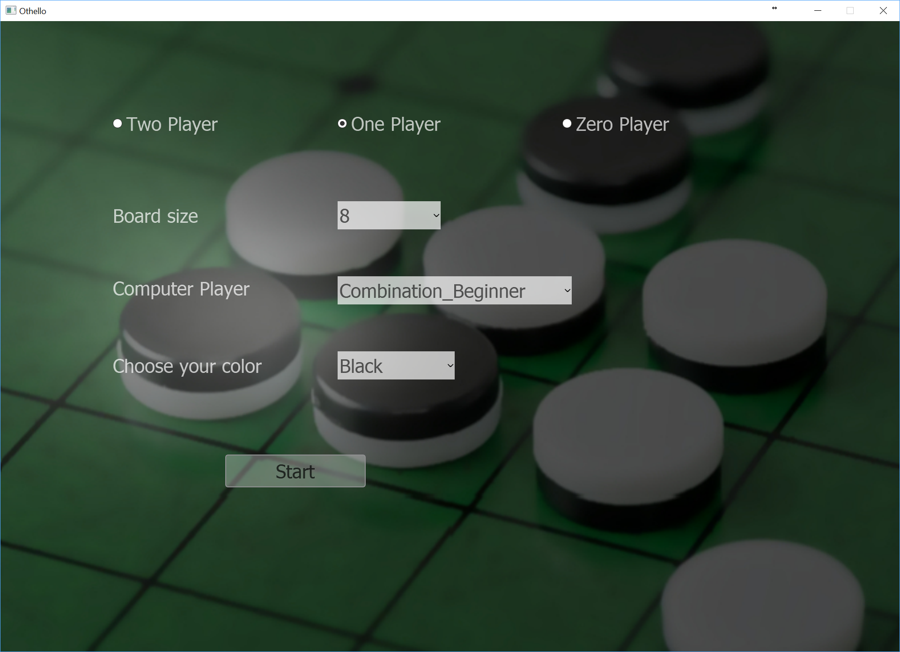
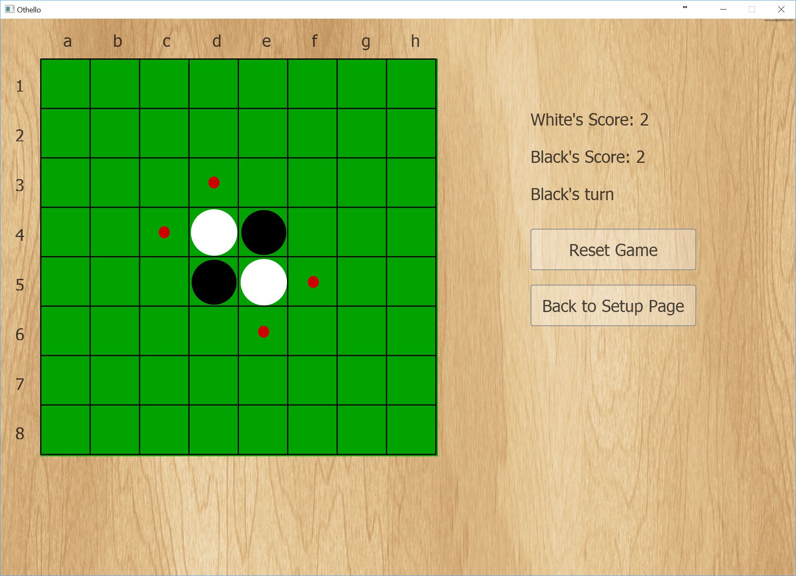

# Othello(Reversi) Game

This project is an Othello player. 
 
<p align="center">
  
</p>

<p align="center">
  
</p>

## The program

This program has 3 playing modes:
* Two player: Two human playing against each other.
* One player: A human playing against computer. 
* Zero player: Two computer players playing against each other.

In each mode you can select the board size you want. (8x8, 10x10, 12x12, 14x14)
In one player mode, you can also select the difficulty level of computer player (easy, normal, hard) and your color (white or black).
In the zero player mode you can select the difficulty level of each computer player.
More details about this program is provided in the [report file](./Documentation/FinalReport.pdf).

## Installation

To run this code you need to have python3 installed on your computer. After installing python3, you can just use the following command after cloning the repository to install the requirements. 

``` bash

pip3 install -r requirements.txt
```

After that you just need to run main.py file using the following command.

``` bash

python3 main.py
```
## References
The Alpha-Beta search overall structure is based on the code in [tonypoer.io website](https://tonypoer.io/2016/10/28/implementing-minimax-and-alpha-beta-pruning-using-python/) with major modifications.

Sannidhanam, Vaishnavi, and Muthukaruppan Annamalai. "An Analysis of Heuristics in Othello." (2004).
